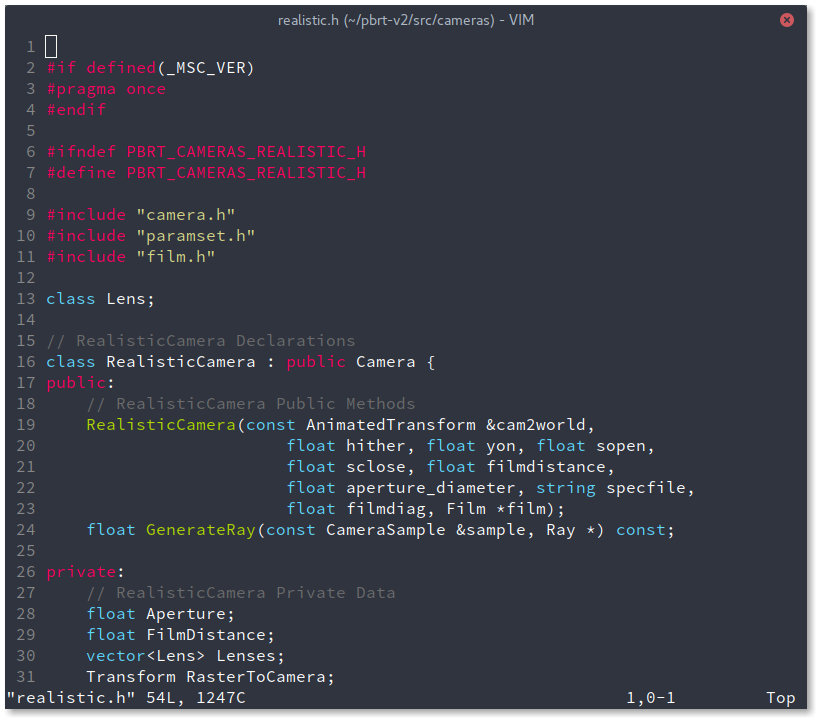

# Tanyuan using Vim

[Vim](http://www.vim.org/) is a free and open source code editor from the old days.

## Philosophy

I was born in a graphical user interface age and Vim is a new way of thinking for me.

The interaction with Vim is really unique and feel like talking. I have never thought of the concept of Normal Mode and Insert Mode. This is what makes Vim so different and attractive. You navigate codes with sequential key strokes, not the shortcut that you have to press several keys simultaneously (chord). It feels more natural. I even talk to myself when pressing the shortcuts.

The configuration (settings) of my Vim is very simple. There are no fancy status bars and split window plugins around. I like Vim for its modest visual appearance. Vim does not tell you to do anything. You think what you need to do for yourself. Each time you learn some new tricks. It is like making a friend.

I use Vim for C++, Python and Processing most of the time.

## How to use my configuration

Put folder `.vim` and file `.vimrc` under home directory `~` on Linux.

Note these are hidden files and you might not see them after download.

`ls -a` in Bash to see hidden files.

### .vimrc

My settings are mainly to work more smoothly in subtle ways. To keep important keys close to reach (the home row), I map `Caps Lock` to `Ctrl` in my operating system and map `Tab` to `Esc` in Vim. (This is the [original keyboard layout](https://en.wikipedia.org/wiki/File:KB_Terminal_ADM3A.svg) back in time when Vi is designed)

Read [Avoid the escape key](http://vim.wikia.com/wiki/Avoid_the_escape_key) for more solutions and trade-offs.

I use `Space` to quickly switch in buffers. And the greatest of all, mapping `;` to `:` to trigger Command Mode in a single key stroke on modern keyboards.

You can read my [.vimrc](.vimrc) with comments in the file to get what you need.

### .vim/

The folder contains several subfolders:

- **colors**: Vim color themes (interface and syntax highlighting).
    - Monokai: Monokai theme with transparent background. This is default theme in Sublime Text.
- **doc**: documents for plugins.
- **indent**: language indent rules.
    - css.vim: Better indentation for CSS.
- **plugin**: plugins.
    - [NERD\_commenter](http://www.vim.org/scripts/script.php?script_id=1218): Easy commenting by `<Leader>c<Space>`. I map it to `Ctrl-/` in `.vimrc`.
- **syntax**: language syntax highlighting.
    - c.vim/cpp.vim: function highlighting for C/C++.
    - gnuplot.vim: syntax highlighting for gnuplot files

## Learn Vim

* First time users: run `vimtutor` command to learn by doing.

* A must read on motivation: [Why, oh WHY, do those #?@! nutheads use vi?](http://www.viemu.com/a-why-vi-vim.html).

* A structured overview for setup and usage: [vim-galore](https://github.com/mhinz/vim-galore).

* Still need help: search with keyword `vim` and you can find all kinds of answers. [Vim Tips Wiki](http://vim.wikia.com/wiki/Vim_Tips_Wiki) is often at the top search results and it provides good answer to the smallest problem you have.

## Using Vim

Some tips I find most useful:

### Moving around

Don't move in Insert Mode and always tap `Esc` to go Normal Mode right away after any insertion for Normal Mode is where the magic happens.

There aren't only `h`, `j`, `k`, `l` to move around to replace arrow keys. You have a lot more ways to move! If you are holding down a key to reach some place, there may exist some better way with less keystrokes.

`w` (word), `b` (backward) to move forward and backward by small word. `W`, `B` by larger word segmented by whitespaces. `e`, `E` (end) move at the last letter of the word, which is good for `a` (append) to insert letters after the word.

`{` and `}` to move by paragraphs (segmented by blank lines) is a quick way to scroll.

`I` to insert at the beginning of the line, and `A` (append) to insert at the end of the line.

Jumping back and forth from last inserted place by `g;` and `g,` is really fast.

Read [Vim anti-patterns](http://blog.sanctum.geek.nz/vim-anti-patterns/) for more.

### Delete/Yank/Change

Delete `d`, yank (copy) `y` and change (replace) `c` are the main power of Vim's editing. Using Vim is like talking and you make up your own sentence.

`cw` to change a word.

`c$` to change the rest of the line.

`c%` to change until the closing brace like ), ], }.

`ciw` (change in word) to replace the word.

`ci"` (change in " ") to replace the string inside " ".

You can replace the `c` in above examples with `d` or `y` for more amazing command.

Remember you can use `.` to repeat any of these command. The magic scales up! These only happen in Normal Mode, so get out of Insert Mode as soon as possible.

### Macros

Record a series of commands and store to a to z and play it anywhere. For example:

1. `qd`	start recording to register d.
2. ...	your complex series of commands.
3. `q`	stop recording.
4. `@d`	execute your macro.
5. `@@`	execute your macro again.

### Insert text in multiple line

`Ctrl-v` to select the lines in Visual Mode and then `I` to insert.

This might be useful but maybe the `.` thing is more powerful or use macros.

### Indentation

`==` to align indentation the current line.

`>aB` to indent a block by {}.

`G=gg` to re-indent the whole file to the current indentation settings. Nice to clean up a messy file once and for all.

### Buffers

I like buffers more than tabs for buffers don't take up screen space, leaving the screen uncluttered and less distraction.

`:e FILENAME` to open a new buffer.

`:ls` to list current buffers.

`:bn` to switch to the next buffer. (I map `Space` to this enabling super fast switching)

Read [Vim Tab Madness. Buffers vs Tabs](https://joshldavis.com/2014/04/05/vim-tab-madness-buffers-vs-tabs/) for more.

### Registers

Vim has its clipboard history to store all your copy called registers. And you can save your own registers by the name of a to z.

`:regs` to list all registers.

`"ay` to yank the selection to register a. (I map `'` to `"` for quick simple tap)

`"ap` to put (paste) register a.

`"0p` to put (paste) the last yank.

I find this really useful to put debugging code snippets around like `std::cout` in C++.

Read [Advanced Vim registers](http://blog.sanctum.geek.nz/advanced-vim-registers/) for more.

### Marks

You can set marks (bookmarks) at any place by the name of a to z like registers.

`:marks` to show all marks.

`ma` to mark current cursor position as mark a.

`` `a`` to jump to mark a.

`Ctrl-o` to jump back. (I lose `Ctrl-i` to jump forward because I map `Tab` to `Esc`. For Vim `Ctrl-i` equals to `Tab`)

### Show tabs

`:set list` to show all invisible characters.

`:set list!` to hide them.

### Autocomplete word

Press `Ctrl-n` (next) and `Ctrl-p` (previous) to autocomplete words, though I usually type the whole thing by myself.

## Beyond Vim

This is the environment I work in with Vim if you would like to know:

- Operating System: [Arch Linux](https://www.archlinux.org/)
- Desktop Environment: GNOME
- Terminal Emulator: GNOME Terminal
- GTK+ Theme: [Arc Theme](https://github.com/horst3180/Arc-theme)
- Terminal font: [Source Code Pro](https://github.com/adobe-fonts/source-code-pro)

I also had `vim-gnome` installed for better GNOME integration (system copy-paste and terminal window title). For more information on Vim packages on Arch Linux, see [Arch Linux Wiki](https://wiki.archlinux.org/index.php/Vim).

[Ranger](http://ranger.nongnu.org/) is a nice console file manager with Vim-like key binding. You would feel like home with everything Vim-like. Though Vim has its file browser, Ranger is better for leisure file browsing.

For a Vim-like web browsing experience, [Vimium](https://chrome.google.com/webstore/detail/vimium/dbepggeogbaibhgnhhndojpepiihcmeb) for Chrome/Chromium and [VimFx](https://addons.mozilla.org/zh-tw/firefox/addon/vimfx/) for Firefox provide customizable key bindings. You can access shortcuts of specific website by hitting `i`.
